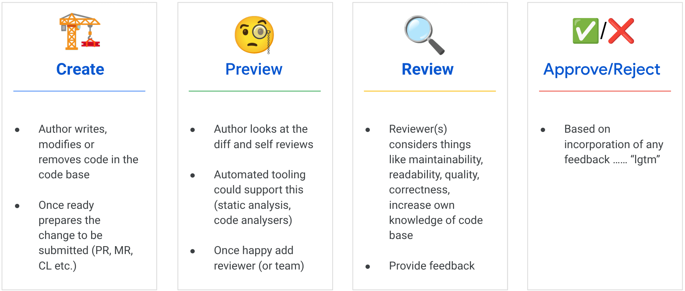

# Persona: The Quality Guardian 🛡️

Code reviews are a vital step in software engineering, its puposes is multi-faceted and can often deplond on the team/organization. 

> A quality control process where developers review each other's code changes to find errors, improve readability, and share knowledge before integrating the code into the main project.

A summarised view of the common steps involved can be broken down into 4 stages
* Codebase change
* Preview before submitting change 
* Review by someone else
* Approval/Rejection based on implementation of feedback provided



This is the evolution of a [blog post](https://sapient.coffee/posts/2024/code-review/) I published in March 2024 on the back of a CLI I started to create in September 2023 to aid with code reviews ([buildey](https://gitlab.com/robedwards/buildey) and [devai](https://github.com/GoogleCloudPlatform/genai-for-developers)).

## "Help me ensure our code meets project standards."

A "Quality Guardian" is any developer who takes responsibility for the quality of the codebase. This role has two key phases:

1.  **The Author (Pre-Flight Check):** Before creating a pull request, the author runs a self-review to ensure their code is clean, documented, and adheres to project standards. The purpsoe is to ensure the code is of high quality and make life easier for the person about to review, examples are:
* Self Review (inc. automated tools, linters and `diff` view)
* Clean up code, useful comments and documentation
* Ensure easy to understand and organised
* Useful commit messages
* Has an updated tests (although possibly TDD)
* Code compiles and passes tests

2.  **The Reviewer (PR/MR Review):** A teammate reviews the pull request to find errors, improve readability, and share knowledge before the code is merged. Highly structured process with the goal to find defects and increase knowledge.
* Identify code to review (diff)
* Maintainability
* Readability
* Quality
* Correctness
* Learning Code

Possibly in a checklist, critically code review can lead to two way learning between author and reviewer.

Static analysis often used to allow reviewers to focus on the understandability and maintainability, not getting distracted by trivial aspects (formatting).


This persona demonstrates how Gemini can be used as an assistant in both phases, making the entire code review lifecycle faster and more effective. The inclusion of AI in this step should not replace the human, in fact arguably one of the most improtant steps in a code review process is to increase more peoples knoweldge of the codebase.

---

## The Pre-Flight Check (Author's Workflow)

If the team is using the [Gemini Code Assist Code Review Agent](https://github.com/marketplace/gemini-code-assist) then a custom style guide stored in `.gemini/styleguide.md` is probably in use, an author can ask Gemini to perform a "pre-flight check" on their code *before* creating a pull request. The stylegude example is borrowed from the [documentation](https://developers.google.com/gemini-code-assist/docs/customize-gemini-behavior-github#style-guide)

### The Flow:

1.  The developer stages their changes using `git add .`.
2.  They run the `/review:local` command in their terminal.
3.  Gemini reads the project's `styleguide.md` and the staged code changes.
4.  It then provides feedback, highlighting any deviations from the project's standards.
5.  The author can address the feedback immediately, leading to a cleaner and faster review process for the whole team.

---

## The Pull Request Review (Reviewer's Workflow)

Once a pull request is created, a reviewer can use Gemini to accelerate their process.

### The Flow:

1.  The reviewer checks out the branch.
2.  They use commands like `/review:summarize` to get a high-level overview of the changes.
3.  They use `/review:check` to ask Gemini to look for common issues based on a general checklist.
4.  They use `/review:comment` to help draft polite and constructive feedback.

This allows the human reviewer to focus on the more complex aspects of the code—like the core logic and overall architecture—while Gemini handles the more repetitive checks.

---

## Automating Reviews in CI/CD (Headless Mode)

While the interactive commands are great for local development, the true power of automation comes from running Gemini CLI in a non-interactive, "headless" mode within a CI/CD pipeline. This allows you to get an automated code review on every pull request and could be an alternative to the [Code Review Agent](https://github.com/marketplace/gemini-code-assist).

The key is the `-p` flag, which lets you send a prompt directly to Gemini without entering the interactive chat.

### Example 1: Simple Shell Script in CI

You can create a simple shell script in your repository that your CI system (like Cloud Build or GitHub Actions) can execute.

**`ci/automated_review.sh`:**
```bash
#!/bin/bash
# Exit on error
set -e

echo "--- Running Automated Gemini Code Review ---"

# Get the diff of the current branch against main
GIT_DIFF=$(git diff main)

# Send the diff to Gemini with a review prompt
gemini -p "Please review the following code changes and check for bugs, style issues, or missing tests." --context "$GIT_DIFF"

echo "--- Review Complete ---"
```
Your CI configuration would then simply run this script: `bash ci/automated_review.sh`.

### Example 2: Using a Custom Docker Image in Cloud Build

For a more robust and portable solution, you can create a Docker image that has the Gemini CLI pre-installed. This image can then be used as a step in your Cloud Build pipeline.

**`cloudbuild.yaml`:**
```yaml
steps:
- name: 'gcr.io/google.com/cloudsdktool/cloud-sdk'
  entrypoint: 'bash'
  args:
  - '-c'
  - |
    # Get the diff of the pull request
    git fetch origin main
    git diff --unified=0 origin/main > /workspace/diff.txt

- name: 'gcr.io/my-project/gemini-reviewer' #  Custom image with Gemini CLI still be be created (this is an illistration)
  entrypoint: 'gemini'
  args:
  - '-p'
  - 'Please review the following code changes.'
  - '--context-from-file'
  - '/workspace/diff.txt'
```

This approach provides a clean, containerized way to add an automated Gemini review to any pull request, ensuring that every change gets a consistent, AI-powered quality check.

---

## Official GitHub Action for Automated Reviews 🚀

For projects hosted on GitHub, there is now an even easier and more integrated way to automate code reviews: the official **Gemini CLI GitHub Action**.

As announced in the [official Google for Developers blog post](https://blog.google/technology/developers/introducing-gemini-cli-github-actions/), this action allows you to run Gemini CLI directly within your workflow, making automated PR reviews a first-class citizen in your development process.

### How It Works

You can create a workflow that triggers on every pull request. The workflow will:
1.  Check out the code.
2.  Use the `google-github-actions/run-gemini-cli` action to execute a prompt.
3.  The prompt will ask Gemini to review the code changes.
4.  The output of the review is then posted back to the pull request as a comment.

### Example Workflow (`.github/workflows/gemini-review.yml`)

```yaml
name: Gemini AI Code Review
on:
  pull_request:

jobs:
  gemini_code_review:
    runs-on: ubuntu-latest
    permissions:
      pull-requests: write
      id-token: write
      contents: read
    steps:
      - name: Checkout Code
        uses: actions/checkout@v4
        with:
          fetch-depth: 0 # Fetches all history for diffing

      - name: Get PR Diff
        id: pr_diff
        run: |
          DIFF=$(git diff ${{ github.event.pull_request.base.sha }} ${{ github.event.pull_request.head.sha }})
          echo "pr_diff<<EOF" >> $GITHUB_OUTPUT
          echo "$DIFF" >> $GITHUB_OUTPUT
          echo "EOF" >> $GITHUB_OUTPUT

      - name: Run Gemini CLI Code Review
        id: gemini_review
        uses: google-github-actions/run-gemini-cli@main
        with:
          prompt: "You are a senior software engineer. Please perform a code review on the following diff, checking for bugs, style issues, and potential improvements. Provide your feedback in a concise, bulleted list."
          context: "${{ steps.pr_diff.outputs.pr_diff }}"

      - name: Comment on PR
        uses: actions/github-script@v7
        with:
          script: |
            github.rest.issues.createComment({
              issue_number: context.issue.number,
              owner: context.repo.owner,
              repo: context.repo.repo,
              body: `**Gemini AI Code Review**:\n\n${{ steps.gemini_review.outputs.result }}`
            })
```

For detailed setup instructions, including how to configure authentication with Workload Identity Federation, please refer to the official repository: **[google-github-actions/run-gemini-cli](https://github.com/google-github-actions/run-gemini-cli)**.

---

## A Note on Command Organization


In this example, we have defined each slash command in its own `.toml` file within the `.gemini/commands/review/` directory. This is a great way to keep your `GEMINI.md` file clean and to manage complex commands with their own descriptions and long prompts.

However, this is a matter of personal preference. It is equally valid to define all the commands directly within the main `GEMINI.md` file.

*   **Use separate `.toml` files when:** Your commands are complex, you want them to have descriptions in the `/help` menu, and you prefer a more organized, modular structure.
*   **Use a single `GEMINI.md` when:** Your commands are simple, and you prefer having all your definitions in one central location.

Both approaches are correct. Choose the one that best fits your project's complexity and your personal workflow.


## Resources

The follow are intresting blogs in this space;
* [Building an automated GitLab Merge Request Review Agent with Gemini CLI](https://medium.com/google-cloud/building-an-automated-gitlab-merge-request-review-agent-with-gemini-cli-35855d53bec1)